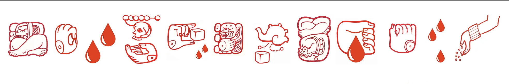

# IDEA 322: Introduction to Arts-Based Research Methods
### Schedule for Spring 2024

*Guadalupe Maravilla, website header: https://www.guadalupemaravilla.com/*

#### Contents
* [Introduction and About the Schedule](#introduction-and-about-the-schedule)
* Week 1: [Monday, January 8, 2024](#week-1)
* Week 2: [Wednesday, January 17, 2024](#week-2)
* Week 3: [Wednesday, January 24, 2024](#week-3)
* Week 4: [Wednesday, January 31, 2024](#week-4)
* Week 5: [Wednesday, February 7, 2024](#week-5)
* Week 6: [Wednesday, February 14, 2024](#week-6)
* Week 7: [Wednesday, February 21, 2024](#week-7)
* Week 8: [Wednesday, February 28, 2024](#week-8)
* Week 9: [Wednesday, March 6, 2024](#week-9)
* Week 10: [Wednesday, March 13, 2024](#week-10)
* Week 11: [SPRING BREAK - no class](#week-11)
* Week 12: [Wednesday, March 27, 2024](#week-12)
* Week 13: [Wednesday, April 3, 2024](#week-13)
* Week 14: [Wednesday, April 10, 2024](#week-14)
* Week 15: [Wednesday, April 17, 2024](#week-15)
* Week 16: [Wednesday, April 24, 2024](#week-16)

***

### Introduction and About the Schedule

This document is the current course schedule broken down by week.

With the exception of Week 1 (when we will meet on January 8th), IDEA 322 will meet in person once per week on Wednesdays. Assignments and readings should be completed on Monday.

In this document, under each week, there is a list of assigned videos, texts, and exercises to complete for the following Monday (by midnight), along with how and where to submit assignments. The contents of this document will be updated throughout the semester.

***

## Unit 1: Introduction to Arts-Based Research

### Week 1
#### January 8, 2024: Introduction to Arts-Based Research

This first week, you should review the [course syllabus](SYLLABUS.md) and access your first lecture guide, reading, and assignments.

DUE **Wednesday, January 10**:
* Review [course syllabus](SYLLABUS.md)
* DOWNLOAD and review [Week 1 guide](https://docs.google.com/presentation/d/1WmKqB9vsJnuo5nms8rZnF6EG2k-Uh8DTEYjSkAjCn6Y/edit?usp=sharing)
* Read [Allan de Souza, "How Art Can Be Thought," (2018)](week_01/desouza_hcabt1.pdf)
* Explore [Gallery 400's upcoming exhibition Contemporary Ex-Votos: Devotion Beyond Medium](https://gallery400.uic.edu/exhibition/contemporaryexvotos/) and [Guadalupe Maravillla's Ex-Voto artworks on his website](https://www.guadalupemaravilla.com/).

***

### Week 2
#### January 15, 2024: Arts-Based Research in Practice

DUE **Monday, January 22**:
* DOWNLOAD and review [Week 2 guide](https://docs.google.com/presentation/d/1KkTglGyG00acVpSkEfouawSVHScyagVNnuhytxwspUg/edit#slide=id.p)
* Read [Susan Sontag, "Notes on Camp" (1964)](week_02/Sontag_Susan_1964_Notes_on_Camp.pdf) and [Victoria Scotti and Gioia Chilton, "Collage as Arts-Based Research," in Handbook of Arts-Based Research, ed. Patricia Leavy, 2018](week_02/leavy_collage.pdf).
  - You may want to consult "The Chicago School of Media Theory" entry on "kitsch": https://lucian.uchicago.edu/blogs/mediatheory/keywords/kitsch/.
  - Regarding "Notes on Camp" by Susan Sontag, make sure to look up images of what Sontag refers to — for example, Aubrey Beardsley drawings, Tiffany lamps, the Brown Derby restaurant on Sunset Boulevard in LA, etc. Consider how opinions about these examples have changed, or stayed the same, since 1964.
* Create [a new GitHub Account](https://github.com/join)
* Email your GitHub username to: [tfunk4@uic.edu](mailto:tfunk4@uic.edu)
* Create [a new public repository (Step 1 only)](https://guides.github.com/activities/hello-world/#repository) and name it 'idea-322-responses-YOUR_GITHUB_USERNAME'
* Create a new [markdown](https://guides.github.com/features/mastering-markdown/#what) file [called 'week-02-camp.md'](https://docs.github.com/en/github/managing-files-in-a-repository/creating-new-files). Sontag's essay is numbered. Choose three of these numbers and find an image that illustrates the topic of each. Change the file name to your own last name and the number you chose. Using [GitHub markdown syntax](https://guides.github.com/features/mastering-markdown/#what) upload these images, and give the media relevant captions. 
* 'Commit' the new file to your repository with a description. We'll discuss your repositories in discussion on Wednesday, January 24th.

***

### Week 3
#### January 24, 2024: Camp, Kitsch, and Collage as Research

DUE **Monday, January 29**:
* DOWNLOAD and review [Week 3 guide](https://docs.google.com/presentation/d/13h_qL-7HnRsnWaST9hcrUAyVZ0QryGTHk4iv9lc3P14/edit?usp=sharing)
* Read [Susan E. Thomas, "Value and Validity of Art Zines as an Art Form," Art Documentation: Journal of the Art Libraries Society of North America, Fall 2009](week_03/thomas.pdf) and [Shannon Michael Cane, "Xerox, Paper, Scissors," Aperture, Spring 2015](week_03/cane.pdf).

***

## Unit 2: Digital Research & Getting Started

### Week 4
#### January 31, 2024: Collage and Digital Research

* DOWNLOAD and review [Week 4 guide](https://docs.google.com/presentation/d/1BFacKZT7UB0pZo7KcozItNlq5iGLlCkpATkHFaEAB-c/edit?usp=sharing)
* Read: [A Student's Guide to Zines](week_04/student_zine_guide.pdf)

DUE Monday, February 5:
* Look through the list of special collections/archives in UIC’s Daley Library (both material and digital): https://researchguides.uic.edu/subject/special-collections-archives
* Come up with 3 proposals for a project that might be submitted either to our own Image of Research competition (https://grad.uic.edu/funding-awards/the-image-of-research/) AND/OR to Graphe, UIC’s English Department’s Journal of Writing and Art (https://engl.uic.edu/graphe/). These proposals should involve something found in the UIC Archives. Consider the different ways in which you might employ collage or zine-based elements.
* Create a repository called "IDEA 322 Project 1." Create a markdown file in that repository called "project1_proposal.md." Write one (short) paragraph for each of your 3 proposals, with at least one sketch or image.

***

### Week 5
#### Week of February 6, 2022: Zines // Zine Culture

DUE Wednesday, February 14:
- Go back to your repository called "IDEA 322 Project 1," and choose one of your proposals (or a mixture of two or three).
- Visit https://www.brooklynmuseum.org/zines-read-at-your-own-risk and browse fully-digitized zines in the exhibition
- Visit https://www.brooklynmuseum.org/stories/how-to-plan-zine-project and check out Neta Bomani’s more in-depth zine guide here: https://d1lfxha3ugu3d4.cloudfront.net/article/images/Neta_Bomani_Zine_3.pdf
- Use the guide for folding an eight-page mini zine. To fit the format, consider how you can divide your proposal into 8 topics/themes.
- Make enough copies for your classmates!

***
## Unit 2: Collections and Curation

### Week 6
#### Week of February 14, 2024: Institutional Critique // Archives and Museums as Collage

One-on-one meetings this week before midterm grades are submitted

* DOWNLOAD and review [Week 6 guide](https://docs.google.com/presentation/d/1XouW7bvgChEIB61a3a6Po8bYb54e8tiyePz2U8NSJxw/edit?usp=sharing)
* Read: [Fred Wilson and Howard Halle's Mining the Museum](week_06/wilson_miningthemuseum.pdf)

* Consider the “Museum of Broken Relationships,” and browse the collections on the Public Collectors website: http://www.publiccollectors.org/. What kinds of museums have you visited? What makes a location a museum, or an “attraction”? What is the difference between a curiosity, or a museum display? Find websites for these museums, and search out their mission statements (if they have one). Do you see any patterns? What do you already have that you could make into an archive, or museum? Would it be physical, virtual, or maybe something else? What purpose would this archive/museum serve, if you opened it to the public?
* Invent such a museum. Give it a name, describe its contents, and what its “mission” would be. Provide sketches, if appropriate. 
* Create a .md file in your responses repository for discussion by 10am, Wednesday (2/21).

***

### Week 7
#### Week of February 21, 2024: Eames Office & Speculative Futures

* DOWNLOAD and review [Week 7 guide](https://docs.google.com/presentation/d/1Jr8wzpV8_m8LpVGKwGFpKifIqNkY440bqizhEZDWXwY/edit?usp=sharing)
* Read: [Beyond Speculative Design: Past - Present - Futures](week_07/Beyond-Speculative-Design.pdf). (It might seem long, but it includes a lot of pictures and diagrams.)
* Consider the variety of projects described in the text. Which of these projects did you find the most engaging, and why?
* Create a .md file in your responses repository for discussion by 10am, Wednesday (2/28).

***

### Week 8
#### Week of February 28, 2024: Speculative Design

* DOWNLOAD and review [Week 8 guide](https://docs.google.com/presentation/d/1KMCkrHMrYLEGLtP-cODe_kmSKzUsQAuFMRCQAxepidA/edit?usp=sharing)
* Watch [Space is the Place](https://www.youtube.com/watch?v=owCPrIEliZc).
* Read the introduction and pick 3 projects to read about in [Beyond Green: Toward a Sustainable Art](/week_08/beyond_green.pdf).
* Create a .md file in your responses folder, and comment on the reading and film: Consider how movements like Afro-Futurism are a kind of Speculative Design; how does science fiction comment upon and critique our present? How are the works included in "Beyond Green" a kind of science fiction? What kinds of narratives might you weave around these objects/projects? Where might you find resources to craft this narrative?
  

***

### Week 9
#### Week of March 6, 2024: Speculative Design Part II

***

### Week 10
#### Week of March 13, 2024: Personal Data Visualization

CREATE YOUR OWN PERSONAL DATA VISUALIZATION

Read about Georgia Lupi and Stefanie Posavec's data visualization correspondence: http://www.dear-data.com/theproject
What kinds of personal data might you visualize from your own life?

Instructions:
* Collect significant data either from an existing data set (for example, your t-shirt collection, record collection, plants in your home, etc.) OR collect data over the course of a week (number of times you drink a hot beverage, kinds of mail you receive, texts you get on your phone, memes you share, color socks you wear, etc.). It could be anything—it can be silly, or serious.
* Figure out the best—or most interesting—way of visualizing the data. Look at the examples from http://www.dear-data.com/all for inspiration.
* Take a sheet of 8.5 x 11 paper and fold it in half. Complete your visualization on one side, and provide a detailed key on the other.
* Make copies for the class!

Due: APRIL 3rd

NOTES:
* You can hand draw the data, or, if you want, you can make it using photography, Adobe Illustrator / Photoshop, or via collage—it's up to you what is the best/easiest for your project.
* The data doesn't need to be in huge numbers or complicated! If you have a collection of 20 vintage spoons, that is enough data for an interesting visualization (depending on how you choose to visualize it)!

***

### Week 11
#### Week of March 20, 2022: SPRING BREAK!

### Week 12
#### Week of March 27, 2022: FIELD TRIP TO BLOCK MUSEUM, NORTHWESTERN UNIVERSITY

***

### Week 13
#### Week of April 3, 2022: Special Collections // Archival Research

We will meet in the Daley Library lobby and engage in a workshop with Special Collections.

***
<!--
### Week 14
#### Week of April 10, 2021

DUE **Thursday, April 13**:
* Non-linear Narrative Project DUE

***

### Week 15
#### Week of April 17, 2021

Continue working on your Final Portfolio Project

***

### Week 16
#### Week of April 24, 2021

DUE **Thursday, April 27**:
* Final Portfolio Project

***

*The classic [Dancing Baby](https://knowyourmeme.com/memes/dancing-baby)* -->
